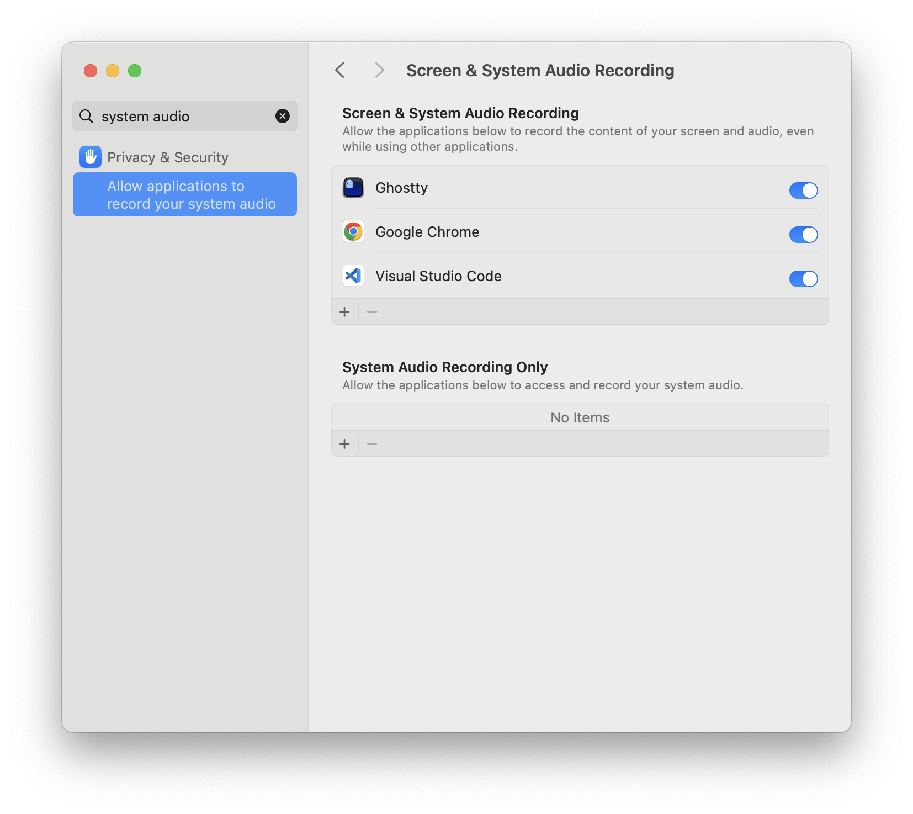

# Dock2

A minimal horizontal taskbar for macOS - similar to a Windows taskbar or KDE panel.

* Click to toggle between minimized and active states for specific windows. Right-click to view options to open or quit the application.
* Multiple windows of the same application will be shown for fast switching.
* Spaces (virtual desktops) are supported. The bar shows open windows for the current Space and any minimized windows.
* The bar can be hidden if you are using a full-screen app. The menu bar provides options to hide/unhide and quit the taskbar.
* Free and open source.


## Usage

There is no release yet, but you can build from source.

```
make
./dist/Dock2
```

For window titles to appear, will need to enable "Screen & System Audio Recording" for the application you start the program from (e.g. Terminal/Ghostty/etc.).



## Development

```
nix develop
make run
```
