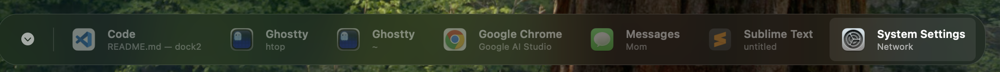

# dock2

A minimal horizontal taskbar for macOS.

* Similar to a Windows or KDE-style paradigm where each element is treated as a distinct, actionable item.
* Displays individual window titles alongside application icons. Interaction toggles between minimized and active states for specific windows.
* The bar remains accessible across all virtual desktops and spaces.



## Usage
```
nix develop
make run
```

You will have to grant Accessibility permissions for this app to work.
